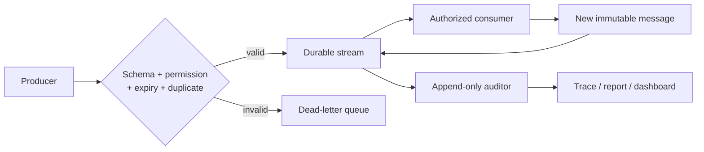
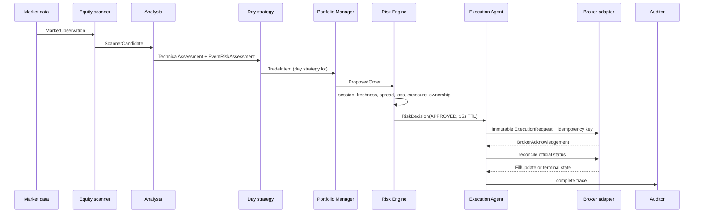
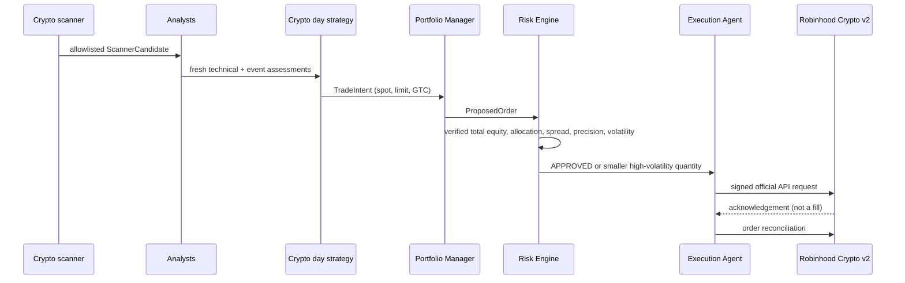
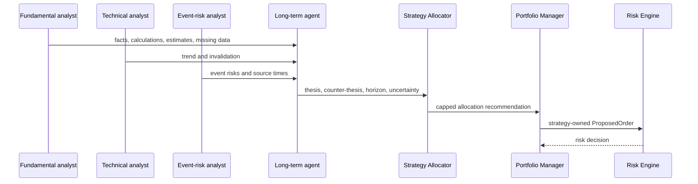
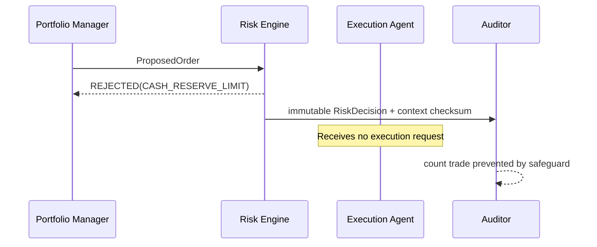
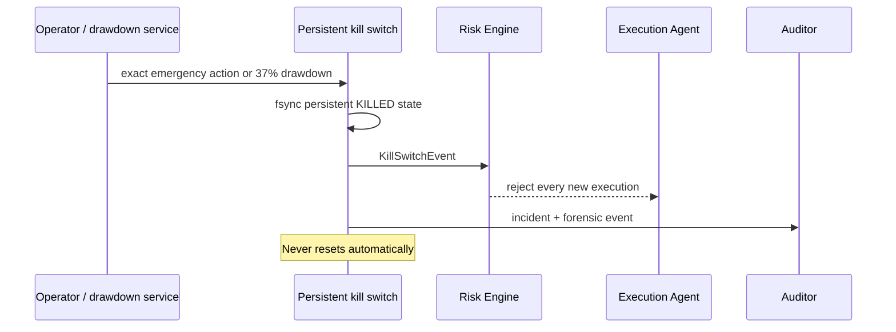

# Agent communication protocol

## Architecture

Every transition is a new immutable, typed `AgentMessage`. Agents cannot edit
prior messages. The message bus validates schema, expiry, permissions, routing,
idempotency, and sensitive-field policy before a message is accepted. Invalid
messages go to a dead-letter record with a machine-readable reason.

PostgreSQL is the durable source of truth. Redis Streams is the intended
real-time transport. SSE carries read-only updates to the console. The
in-memory implementations are test substitutes, not production durability.

## Envelope schema

| Field | Purpose |
|---|---|
| `message_id` | Globally unique immutable message |
| `message_type` / `schema_version` | Versioned payload contract |
| `trace_id` | Complete source-to-outcome decision chain |
| `correlation_id` | Related business operation |
| `causation_id` | Immediately preceding message |
| `agent_id` / `agent_version` | Accountable producer |
| `strategy_id` | Strategy ownership |
| `asset_class` / `symbol` | Explicit asset binding |
| `created_at` / `data_timestamp` / `expires_at` | UTC lifecycle and freshness |
| `confidence` / `uncertainty` | Bounded declared uncertainty, never hidden reasoning |
| `source_references` | Timestamped, checksummed evidence references |
| `payload` | Type-discriminated Pydantic payload |
| `status` | Created, accepted, rejected, expired, duplicate, or failed |
| `idempotency_key` | Duplicate suppression |

Messages reject credential-like keys. Logs and reports retain structured facts,
metrics, evidence, rules, and decision summaries; they never retain private
chain-of-thought.

## Lifecycle, retry, timeout, and failure behavior

1. Producer creates a frozen message with a timezone-aware data timestamp and
   expiry.
2. Permission routing verifies that the producer may emit that message type.
3. Idempotency claims the key. A repeat becomes `DUPLICATE` and is not replayed.
4. The bus persists before delivering to an authorized consumer.
5. A consumer emits a new message referencing the predecessor.
6. Transient analysis failures retry at most twice with bounded backoff.
7. Risk and execution authorization do not retry an ambiguous action.
8. Expired inputs are rejected, not refreshed implicitly.
9. Unknown broker state prevents resubmission until official reconciliation.
10. Database, queue, audit, broker, or time-sync failure blocks new exposure.

No timeout means approval. If a required agent does not respond, orchestration
emits a failed health/audit event and the decision chain closes without an
order.

## Conflict resolution

The Portfolio Manager owns netting, but each position remains partitioned by
`strategy_lot_id`. A day strategy cannot sell a long-term lot. Opposing intents
produce a `ConflictEvent`; explicit ownership, risk reduction, configured
priority, and cash/exposure rules resolve it. Duplicate proposals are
idempotently suppressed. Unresolved ownership or quantity conflicts are
rejected.

## Equity day-trade flow

The first 15 equity-market minutes are blocked by default; the day-entry cutoff,
earnings proximity, position cap, and daily trade count are deterministic risk
inputs.

## Crypto day-trade flow

Only BTC and ETH are initially allowlisted, and only when official discovery
confirms account, symbol, precision, size, and tradability.

## Long-term investment flow

Ordinary intraday noise does not trigger long-term exits. Thesis invalidation,
scheduled review, event state, position and sector caps remain explicit.

## Rejected-trade flow

## Kill-switch flow

The emergency-stop API is deterministic and requires authentication plus
`EMERGENCY STOP`. Offline hard-kill reset is deliberately outside all agents and
must follow the incident runbook.
