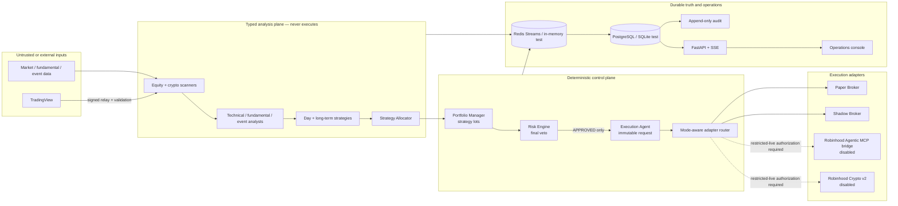

# Quant Desk architecture

## Safety posture

Quant Desk is a fail-closed, event-driven research and operations platform. The
development posture is `PAPER`; live equity, live crypto, and autonomous
execution flags are all false. Analysis may be probabilistic, but calculations,
permissions, portfolio ownership, risk authorization, idempotency, execution,
reconciliation, and kill switches are deterministic.

The legacy Alpaca bots and read-only dashboards remain intact and hard-locked to
paper accounts. The new platform is an additive control plane around typed
agents, not a silent conversion of those bots to live trading.

## Component model

## Trust boundaries

1. External data is untrusted until schema, source, timestamp, freshness, and
   quality checks pass.
2. LLM-capable analysis agents may emit evidence and recommendations only.
3. The Portfolio Manager may produce an immutable `ProposedOrder`; it has no
   broker reference.
4. The deterministic Risk Engine is the sole risk authority and cannot execute.
5. The Execution Agent accepts only an approved order, fresh risk decision,
   mode authorization, idempotency key, and verified adapter.
6. Adapters cannot be selected by the browser. The dashboard calls API controls,
   never brokerage endpoints.
7. A broker acknowledgement is not a fill. All states remain uncertain until
   reconciled against the official interface.

## Runtime modes

| Mode | Signals | Broker submission | Notes |
|---|---:|---:|---|
| `BACKTEST` | Historical | No | Supplied data only |
| `PAPER` | Current/synthetic | Paper adapter only | Default |
| `SHADOW` | Current | No | Records intended actions |
| `RESTRICTED_LIVE` | Current | Only separately activated asset class | Offline record and caps required |
| `STANDARD_LIVE` | Current | Not implemented for automatic activation | Environment activation rejected |
| `PAUSED` | Observe | Risk-reducing policy only | New entries blocked |
| `CAPITAL_PRESERVATION` | Observe | Carefully controlled exits only | No new entries |
| `KILLED` | Observe | New execution blocked | Persistent manual reset |

## Data and durability

SQLAlchemy models cover agent definitions and health, messages, traces,
strategies, risk decisions, proposed orders, broker orders, fills, account
snapshots, kill events, configuration versions, audit events, and incidents.
PostgreSQL is the production target; SQLite supports local tests. Alembic owns
schema migrations. Message and audit repositories expose append-only APIs.

Redis Streams is the production queue design. The in-memory bus provides the
same typed semantics for deterministic tests. Queue, database, audit, broker,
and time-sync health are required risk inputs; an unhealthy dependency blocks
new orders.

## Deployment

- `apps/api`: local operations API and static console host.
- `apps/worker`: worker entry point with live-flag startup refusal.
- `dashboard`: browser-safe operations console.
- `docker-compose.yml`: local PostgreSQL and Redis dependencies.
- GitHub Pages: static, read-only views. It cannot reach broker adapters.
- GitHub Actions: tests, lint, type checking, migration validation, secret and
  dependency review, and Docker build. Live broker tests are prohibited.

## Known boundaries

- No authenticated Robinhood Agentic MCP session was available during
  development, so equity capabilities are modeled from official documentation
  and remain unverified at runtime.
- The Robinhood Crypto adapter is implemented against the documented v2 API,
  but is disabled and unauthenticated. It requires a separately verified total
  account equity value because buying power is not treated as equity.
- No strategy has been promoted. New strategy definitions remain `RESEARCH`;
  no backtest result is fabricated.
