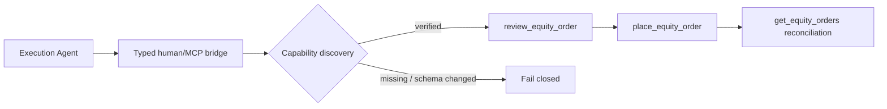

# Equity execution boundary

## Status

**Implemented but not authenticated; execution disabled.** No real order was
submitted. Capability discovery cannot be declared complete until the user
authenticates the official Robinhood Agentic Trading MCP and the exact exposed
tool schemas are inspected.

Robinhood documents Agentic Trading as a dedicated account and MCP-based
workflow. The current official equity tool family includes account, portfolio,
position, quote, order, tradability, review, placement, and cancellation
operations. The adapter uses a schema-bound bridge and never invents a fallback
HTTP endpoint. See the official
[Agentic Trading overview](https://robinhood.com/us/en/support/articles/agentic-trading-overview/)
and [trading tools](https://robinhood.com/us/en/support/articles/trading-with-your-agent/).

## Boundary

The repository does not pretend a persistent server can call a user’s desktop
MCP session. `RobinhoodAgenticAdapter` instead accepts an injected bridge that
must be implemented in a genuine authenticated runtime or operated by a human.
Before each restricted-live request it must:

1. call official account/portfolio visibility tools;
2. match the dedicated Agentic account to the locally expected identity;
3. discover tradability, supported order types, time in force, fractional
   support, sessions, cancellation, positions, and account visibility;
4. call the official review tool;
5. submit only the exact risk-approved reviewed order;
6. capture the official broker order ID; and
7. reconcile status without treating acknowledgement as fill.

Unsupported asset classes, symbols, order types, options, short selling, margin,
and schema drift fail closed. Options are prohibited even if the remote tool
supports them.

## Manual work still required

- Authenticate the official Robinhood MCP through its user-facing flow.
- Inspect and record the actual tool schemas exposed to this account.
- Implement or select the genuine bridge runtime; do not proxy a desktop session
  implicitly.
- Verify dedicated account identity and all capabilities in PAPER/SHADOW
  observation.
- Complete the restricted-live checklist and separate equity activation record.
